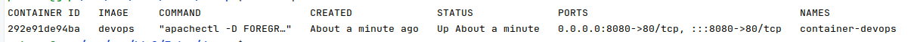

# INITIATION À DEVOPS

## Introduction

### Module 1 :  Comprendre DevOps

- Définition et histoire de DevOps.
- Les objectifs de DevOps : Amélioration de la livraison de logiciels, collaboration, et qualité.
- Les piliers de DevOps : Culture, Automatisation, Lean, Mesure, et Partage (CALMS).

### Module 2 :  Culture DevOps
- Importance de la culture d'équipe et de la collaboration entre les développeurs (Dev) et les opérations (Ops).
- Rupture des silos, responsabilité partagée, et apprentissage continu.
- Études de cas sur la transformation culturelle.

## Principes et Pratiques
### Module 3 :  Intégration Continue (CI) et Livraison Continue (CD)
- Principes de CI/CD.
- Outils de CI/CD populaires : Jenkins, GitLab CI, GitHub Actions.
- Mise en place d'un pipeline CI/CD simple.

### Module 4 :  Gestion de la Configuration et Automatisation
- Introduction à la gestion de la configuration : Ansible, Chef, Puppet.
- Infrastructure as Code (IaC) : Terraform, CloudFormation.
- Automatisation des processus de déploiement.

### Module 5 : Conteneurisation et Orchestration
- Introduction aux conteneurs : Docker.
- Orchestration de conteneurs : Kubernetes.
- Avantages des conteneurs pour les environnements DevOps.

## Surveillance, Journalisation, et Sécurité
### Module 6 : Surveillance et Journalisation
- Outils de surveillance : Prometheus, Nagios.
- Journalisation : ELK Stack (Elasticsearch, Logstash, Kibana), Splunk.
- Surveillance proactive et alerte.

### Module 7 : Sécurité DevOps (DevSecOps)
- Principes de sécurité intégrés dans le cycle de vie DevOps.
- Outils de sécurité automatisés : scanners de vulnérabilité, tests de pénétration automatisés.
- Gestion des secrets et des accès.

## Mise en Pratique et Projets
### Module 8 : Mise en Pratique
- Configuration d'un environnement de développement intégrant les pratiques DevOps.
- Projets pratiques : création d'un pipeline CI/CD, déploiement d'une application web simple en utilisant des conteneurs.

### Module 9 : Cas d'étude et Projets de Groupe
- Analyse de cas d'étude réels de mise en œuvre de DevOps.
- Projets de groupe pour consolider les connaissances et les compétences acquises.

## Conclusion et Ressources pour Continuer à Apprendre
- Récapitulatif du cours et des compétences acquises.
- Chemins de progression et certifications en DevOps.
- Ressources pour une autoformation continue.

## Mini-Projet : Création d'un Portfolio DevOps
- Installer et configurer un environnement de développement pour les projets DevOps (Git, Docker, CI/CD).
- Création d'un portfolio pour documenter les projets et compétences DevOps acquises.
- Utilisation d'outils de CI/CD pour déployer le portfolio en ligne automatiquement avec GitHub Pages/Actions.

---


## Informations sur le Cours

- **Formateur** : PATERNE GUÉLABLÉ GNONZION
- **Public Cible** : Débutants, Développeurs, Administrateurs Système, Ingénieurs DevOps, Étudiants en Informatique.
- **Prérequis** : Connaissances de base en développement logiciel, systèmes d'exploitation, et réseaux.
- **Langue** : Français
- **Contacts** : [ [Email](mailto:paterne81@hotmail.fr) | [LinkedIn](https://www.linkedin.com/in/gnpinformatique/) | [GitHub](https://github.com/teamflp) ]

---

## Introduction

DevOps est une approche de développement logiciel qui vise à améliorer la collaboration entre les équipes de développement (Dev) et d'opérations (Ops) pour accélérer la livraison de logiciels de qualité. En intégrant les pratiques de développement et d'opérations, DevOps permet de réduire les délais de mise en production, d'améliorer la qualité des logiciels, et de favoriser l'innovation continue.

Ce cours d'initiation à DevOps vise à présenter les principes, les pratiques, et les outils essentiels de DevOps pour permettre aux participants de comprendre les enjeux de cette approche, d'acquérir des compétences pratiques, et de se préparer à des projets concrets en entreprise.

### Objectifs du Cours

- Comprendre les principes et les objectifs de DevOps.
- Connaître les piliers de DevOps : Culture, Automatisation, Lean, Mesure, et Partage.
- Maîtriser les outils et les pratiques de DevOps : CI/CD, Gestion de la Configuration, Conteneurisation, Orchestration, Surveillance, Sécurité.
- Mettre en pratique les compétences acquises à travers des projets concrets.
- Se préparer à des certifications en DevOps et à des projets professionnels en entreprise.
- Créer un portfolio DevOps pour documenter les projets et compétences acquises.

### Comprendre DevOps

#### Définition et histoire de DevOps.

**DevOps** est une approche qui vise à unifier le développement logiciel (`Dev`) et l'exploitation informatique (`Ops`). L'objectif est d'améliorer la collaboration entre ces deux fonctions pour accélérer la livraison de logiciels de haute qualité. DevOps est né de la nécessité de répondre plus rapidement aux besoins du marché et d'adopter une culture de collaboration plutôt que de travailler en silos. Cela signifie que les équipes de développement et d'opérations travaillent ensemble pour automatiser les processus, améliorer la qualité des logiciels, et favoriser l'innovation continue.

Le terme `DevOps` est apparu pour la première fois en 2009 lors d'une conférence sur les systèmes informatiques agiles. Depuis lors, DevOps est devenu une approche populaire pour les entreprises qui cherchent à améliorer leur agilité, leur efficacité, et leur qualité logicielle.
Cette pratique est devenue une norme dans l'industrie du logiciel, et de nombreuses entreprises ont adopté DevOps pour améliorer leur processus de développement et de déploiement.

Travailler en `silos ou barrière` signifie que les équipes de développement et d'opérations travaillent de manière isolée, ce qui peut entraîner des retards, des erreurs, et des problèmes de communication. En adoptant une approche DevOps, les équipes collaborent étroitement pour automatiser les processus, partager les responsabilités, et améliorer la qualité des logiciels.

**Devops est composé de deux mots** : `Dev` pour développement et `Ops` pour opérations. Il s'agit d'une approche qui vise à améliorer la collaboration entre les équipes de développement et d'opérations pour accélérer la livraison de logiciels de qualité. DevOps repose sur cinq piliers fondamentaux : `Culture`, `Automatisation`, `Lean`, `Mesure`, et `Partage` (CALMS). Ces piliers sont essentiels pour mettre en œuvre avec succès les pratiques DevOps et obtenir des résultats positifs.

#### Les objectifs de DevOps : Amélioration de la livraison de logiciels, collaboration, et qualité.

DevOps a pour objectif d'améliorer la livraison de logiciels en accélérant les cycles de développement, en réduisant les délais de mise en production, et en améliorant la qualité des logiciels. En favorisant la collaboration entre les équipes de développement et d'opérations, DevOps permet de réduire les risques, d'augmenter la productivité, et d'innover plus rapidement.

- Les piliers de DevOps : Culture, Automatisation, Lean, Mesure, et Partage (CALMS).
DevOps repose sur cinq piliers fondamentaux : `Culture`, `Automatisation`, `Lean`, `Mesure`, et `Partage` (CALMS). Ces piliers sont essentiels pour mettre en œuvre avec succès les pratiques DevOps et obtenir des résultats positifs.

- **Culture** : La culture est un élément clé de DevOps. Il s'agit de favoriser la collaboration, la confiance, et la responsabilité partagée entre les équipes de développement et d'opérations. La culture DevOps encourage l'apprentissage continu, l'innovation, et l'amélioration continue.
Cette culture est basée sur des valeurs telles que la transparence, la communication ouverte, le respect, et la responsabilité. En adoptant une culture DevOps, les équipes peuvent travailler ensemble de manière plus efficace, résoudre les problèmes plus rapidement, et livrer des logiciels de qualité plus rapidement.


- **Automatisation** : L'automatisation des processus est essentielle pour accélérer les cycles de développement, réduire les erreurs, et améliorer la qualité des logiciels. En automatisant les tâches répétitives, les équipes peuvent se concentrer sur des tâches à plus forte valeur ajoutée.
L'automatisation peut être appliquée à toutes les étapes du cycle de vie du logiciel, de la compilation et des tests à la livraison et au déploiement. En adoptant des outils d'automatisation, les équipes peuvent réduire les délais, améliorer la qualité, et favoriser l'innovation continue.


- **Lean** : Le Lean vise à éliminer les gaspillages, à réduire les délais, et à optimiser les processus. En adoptant des pratiques Lean, les équipes peuvent améliorer l'efficacité, la qualité, et la satisfaction des clients.
Lean veut dire `mince` en français qui repose sur des principes tels que l'identification des gaspillages, l'amélioration continue, et l'optimisation des processus. En appliquant des pratiques Lean, les équipes peuvent réduire les délais de mise en production, améliorer la qualité des logiciels, et s'adapter plus rapidement aux changements.


- **Mesure** : La mesure est essentielle pour évaluer les performances, identifier les problèmes, et améliorer les processus. En mesurant les indicateurs clés de performance (KPI), les équipes peuvent prendre des décisions éclairées et améliorer en continu en se servant des logiciels opensource de monitoring et de journalisation.
La mesure permet de suivre les progrès, d'identifier les goulots d'étranglement, et de prendre des mesures correctives. En adoptant une approche basée sur les données, les équipes peuvent améliorer la qualité des logiciels, réduire les risques, et innover plus rapidement.
Pour y parvenir les outils de monitoring et de journalisation sont essentiels pour collecter, analyser, et visualiser les données. Ces outils permettent de surveiller les performances, d'identifier les problèmes, et de prendre des mesures correctives.

  - Les outils les plus populaires pour la mesure sont `Prometheus`, `Grafana`, `Nagios`, `ELK Stack` (Elasticsearch, Logstash, Kibana), `Splunk`, et d'autres outils de surveillance et de journalisation.


- **Share (Partage)** : Le partage des connaissances, des bonnes pratiques, et des retours d'expérience est essentiel pour favoriser l'apprentissage, l'innovation, et l'amélioration continue. En partageant les succès et les échecs, les équipes peuvent progresser ensemble et atteindre leurs objectifs plus rapidement.
Le partage peut se faire à travers des réunions d'équipe, des formations, des retours d'expérience, des communautés en ligne, et d'autres moyens de communication. En privilégiant le partage, les équipes peuvent renforcer leur culture, améliorer leur collaboration, et innover plus rapidement.


### Culture DevOps
La culture DevOps est un élément clé de la réussite de DevOps. Elle repose sur des valeurs telles que la collaboration, la confiance, la responsabilité partagée, et l'apprentissage continu. En adoptant une culture DevOps, les équipes peuvent travailler ensemble de manière plus efficace, résoudre les problèmes plus rapidement, et livrer des logiciels de qualité plus rapidement.


#### Importance de la culture d'équipe et de la collaboration entre les développeurs (Dev) et les opérations (Ops).

La culture `DevOps` souligne l'importance de la `collaboration` et de la `communication` entre les équipes de développement et d'exploitation. Par exemple, une équipe qui adopte DevOps pourrait organiser des réunions quotidiennes courtes pour discuter des progrès et des blocages, favorisant ainsi une compréhension mutuelle et une résolution rapide des problèmes.

### Rupture des silos, responsabilité partagée, et apprentissage continu.

En DevOps, il est essentiel de briser les `silos` entre les équipes de développement et d'exploitation. Les équipes doivent travailler ensemble de manière transparente, partager les responsabilités, et collaborer pour atteindre des objectifs communs. Par exemple, les développeurs peuvent être responsables de l'automatisation des tests, tandis que les opérations peuvent être responsables de l'automatisation du déploiement.


### Études de cas sur la transformation culturelle.*

Un exemple de transformation culturelle réussie est l'adoption de DevOps par Netflix. Netflix a mis en place une culture DevOps basée sur la collaboration, l'automatisation, et l'innovation continue. Grâce à cette approche, Netflix a pu réduire les délais de mise en production, améliorer la qualité des logiciels, et innover plus rapidement. Cette transformation culturelle a permis à Netflix de devenir un leader de l'industrie du streaming vidéo et de proposer des services de haute qualité à ses clients.


## Principes et Pratiques
### Module 3 : Intégration Continue (CI) et Livraison Continue (CD)

L'intégration continue (CI) et la livraison continue (CD) sont des pratiques essentielles de DevOps qui visent à automatiser les processus de développement, de test, et de déploiement pour accélérer la livraison de logiciels de qualité. En adoptant CI/CD, les équipes peuvent réduire les délais, améliorer la qualité, et favoriser l'innovation continue.


#### Principes de CI/CD

- **L'intégration continue** (`CI`) consiste à automatiser le processus de compilation, de test, et de validation du code à chaque modification apportée au référentiel de code. L'objectif de la CI est de détecter les erreurs plus tôt, de réduire les conflits de fusion, et d'améliorer la qualité du code.


- **La livraison continue** (`CD`) consiste à automatiser le processus de déploiement du code en production à chaque modification apportée au référentiel de code. L'objectif de la CD est de réduire les délais de mise en production, d'améliorer la qualité des logiciels, et de favoriser l'innovation continue.

Ensemble, CI/CD assurent que le code est toujours dans un état déployable.

#### Outils de CI/CD populaires : Jenkins, GitLab CI, GitHub Actions.

Il existe de nombreux outils de CI/CD populaires qui permettent d'automatiser les processus de développement, de test, et de déploiement. Certains des outils les plus populaires sont :

**1. Jenkins** : Jenkins est un serveur d'automatisation open source qui permet de créer des pipeline. C'est-à dire des `workflows` automatisés pour les processus de développement, de test, et de déploiement. Jenkins offre une large gamme de plugins et d'intégrations pour les équipes de développement. Les workflows sont définis dans un fichier `Jenkinsfile` qui décrit les étapes du pipeline.

Voici un exemple de pipeline `Jenkins` qui comporte trois étapes : `Build`, `Test`, et `Deploy`. Chaque étape exécute une série de commandes shell pour compiler, tester, et déployer l'application.
```groovy
pipeline {
    agent any

    stages {
        stage('Build') {
            steps {
                echo 'Commencer la phase de build...'
                // Insérez ici la commande shell pour compiler votre projet. Exemple pour Maven :
                sh 'mvn clean package'
            }
        }

        stage('Test') {
            steps {
                echo 'Commencer les tests...'
                // Insérez ici la commande shell pour lancer vos tests. Exemple pour Maven :
                sh 'mvn test'
            }
        }

        stage('Deploy') {
            steps {
                echo 'Déploiement de l\'application...'
                // Insérez ici la commande shell pour déployer votre application.
                // Cela peut dépendre de votre environnement de déploiement. Exemple de déploiement simple :
                sh 'scp target/monapp.jar monuser@monserveur:/chemin/vers/le/dossier/deploy'
                sh 'ssh monuser@monserveur "java -jar /chemin/vers/le/dossier/deploy/monapp.jar"'
            }
        }
    }
    post {
        success {
            echo 'Le pipeline a été exécuté avec succès.'
        }
        failure {
            echo 'Le pipeline a échoué.'
        }
    }
}

```

Voyons en détail les étapes du pipeline :

Explication du pipeline Jenkins :

- **agent any** : Spécifie que le pipeline peut s'exécuter sur n'importe quel agent disponible dans le système Jenkins.
- **stages** : Définit les différentes étapes du pipeline.
- **stage('Build')** : La première étape, qui compile le projet. L'exemple montre l'utilisation de Maven (mvn clean package), mais vous devrez adapter cette commande selon votre environnement de build.
- **stage('Test')** : La seconde étape, qui exécute les tests. De nouveau, l'exemple utilise Maven (mvn test) pour lancer des tests unitaires. Modifiez cette commande selon votre cadre de tests.
- **stage('Deploy')** : La dernière étape, qui déploie l'application. L'exemple montre un transfert simple du fichier JAR via SCP suivi d'une commande SSH pour démarrer l'application sur le serveur cible. Ces commandes doivent être personnalisées selon votre stratégie de déploiement et infrastructure.
- **post** : Bloc qui permet de définir des actions à exécuter à la fin du pipeline, comme afficher un message selon que le pipeline a réussi ou échoué.

Étant donné que Jenkins est un outil open source, il est largement utilisé par les équipes de développement pour automatiser les processus de CI/CD.

**2. GitLab CI** : GitLab CI est un outil intégré de CI/CD qui s'intègre directement avec GitLab pour automatiser les processus de développement, de test, et de déploiement. GitLab CI offre une interface conviviale et des fonctionnalités avancées pour les équipes de développement.

Voici un exemple simple de pipeline GitLab CI configuré dans un fichier `.gitlab-ci.yml`, qui décrit trois étapes : Build, Test, et Deploy. Chaque étape exécute une série de commandes shell.
```yaml
stages:
  - build
  - test
  - deploy

build_job:
  stage: build
  script:
    - echo "Commencer la phase de build..."
    - # Insérez ici la commande pour compiler votre projet. Par exemple, pour un projet Java Maven :
    - mvn clean package

test_job:
  stage: test
  script:
    - echo "Commencer les tests..."
    - # Insérez ici la commande pour lancer vos tests. Par exemple, pour exécuter des tests unitaires avec Maven :
    - mvn test

deploy_job:
  stage: deploy
  script:
    - echo "Déploiement de l'application..."
    - # Insérez ici la commande pour déployer votre application. Cela dépend de votre environnement cible.
    - # Pour un déploiement sur un serveur SSH :
    - scp target/monapp.jar monuser@monserveur:/chemin/vers/le/dossier/deploy
    - ssh monuser@monserveur 'java -jar /chemin/vers/le/dossier/deploy/monapp.jar'
  only:
    - master
```

Dans cet exemple, le pipeline GitLab CI comporte trois étapes : `build`, `test`, et `deploy`. Chaque étape exécute une série de commandes shell pour compiler, tester, et déployer l'application. Le pipeline est déclenché uniquement lorsque des modifications sont apportées à la branche `master`.

Explication du pipeline :

- **stages** : Définit les étapes du pipeline. Chaque étape sera exécutée séquentiellement.
- **build_job** : La première étape qui compile le projet. L'exemple utilise Maven (mvn clean package) pour compiler un projet Java, mais vous devrez remplacer cette commande par celle correspondant à votre projet.
- **test_job** : La seconde étape exécute les tests. Ici, mvn test est utilisé pour exécuter les tests unitaires d'un projet Maven. Adaptez la commande en fonction de votre cadre de test.
- **deploy_job** : La dernière étape déploie l'application sur l'environnement de production ou un autre environnement cible. Cet exemple montre comment transférer un fichier JAR compilé via SCP puis le démarrer avec SSH. Les détails spécifiques (comme l'adresse du serveur, l'utilisateur, et le chemin) doivent être adaptés à votre infrastructure.
- **only** : Indique que le job de déploiement doit s'exécuter uniquement sur la branche master. Cela est utile pour s'assurer que seules les versions approuvées sont déployées en production.


**3. GitHub Actions** : GitHub Actions est un outil de CI/CD intégré à GitHub qui permet d'automatiser les processus de développement, de test, et de déploiement. GitHub Actions offre une intégration transparente avec GitHub et une large gamme de workflows prédéfinis pour les équipes de développement.
  Créer un workflow GitHub Actions implique de définir un fichier YAML dans le répertoire .github/workflows de votre dépôt GitHub. Voici un exemple de fichier main.yml qui configure un workflow simple avec trois étapes : Build, Test, et Deploy.

Voici un exemple simple de workflow GitHub Actions configuré dans un fichier `.github/workflows/main.yml`, qui décrit trois étapes : Build, Test, et Deploy. Chaque étape exécute une série de commandes shell.

```yaml
name: CI/CD Pipeline

on: [push]

jobs:
  build:
    runs-on: ubuntu-latest
    steps:
      - uses: actions/checkout@v2
      - name: Build
        run: |
          echo "Commencer la phase de build..."
          # Insérez ici la commande pour compiler votre projet. Par exemple, pour un projet Maven :
          mvn clean package

  test:
    needs: build
    runs-on: ubuntu-latest
    steps:
      - uses: actions/checkout@v2
      - name: Test
        run: |
          echo "Commencer les tests..."
          # Insérez ici la commande pour lancer vos tests. Par exemple, pour Maven :
          mvn test

  deploy:
    needs: test
    runs-on: ubuntu-latest
    steps:
      - uses: actions/checkout@v2
      - name: Deploy
        run: |
          echo "Déploiement de l'application..."
          # Insérez ici la commande pour déployer votre application. Cela dépend de votre cible de déploiement.
          # Exemple : Déployer sur un serveur SSH (assurez-vous de configurer les secrets SSH_KEY et SSH_HOST auparavant) :
          scp target/monapp.jar ${{ secrets.SSH_USER }}@${{ secrets.SSH_HOST }}:/chemin/vers/le/dossier/deploy
          ssh ${{ secrets.SSH_USER }}@${{ secrets.SSH_HOST }} 'java -jar /chemin/vers/le/dossier/deploy/monapp.jar'
    environment: 
      name: production
      url: ${{ secrets.DEPLOY_URL }}
```
Explications :

- **name**: Définit le nom du workflow qui apparaîtra sur GitHub.
- **on**: Spécifie l'événement qui déclenchera le workflow, ici chaque push dans le dépôt.
- **jobs**: Décrit les emplois à exécuter, dans ce cas, build, test, et deploy.
- **runs-on**: Définit le type de machine virtuelle sur laquelle le job s'exécutera, ici ubuntu-latest.
- **uses**: actions/checkout@v2: Utilise l'action checkout pour cloner votre dépôt Git dans l'environnement de build.
- **name**: Donne un nom lisible par l'humain à chaque étape pour faciliter le suivi dans l'interface GitHub Actions.
- **run**: Exécute les commandes shell spécifiées dans une machine virtuelle Ubuntu.
- **needs**: Spécifie que le job test a besoin que le job build soit terminé avant de commencer, et le même pour deploy avec test.
- **environment**: Définit l'environnement cible pour le job de déploiement. Vous pouvez configurer les environnements dans GitHub pour gérer des secrets ou des règles de déploiement spécifiques.

Notez que pour le déploiement via SSH, vous devriez configurer les secrets (comme SSH_USER, SSH_HOST, et éventuellement SSH_KEY) dans les paramètres de votre dépôt GitHub pour sécuriser vos informations d'identification. Les commandes exactes pour le build, le test, et le déploiement dépendront de votre pile technologique et de votre infrastructure de déploiement.

### Mise en place d'un pipeline CI/CD simple.

Un exemple simple pourrait être la configuration d'un pipeline GitHub Actions pour une application web. À chaque push sur la branche principale, le pipeline pourrait exécuter des tests automatisés et, si les tests réussissent, déployer l'application sur un serveur de production.

Le pipeline pourrait être configuré dans un fichier `.github/workflows/main.yml` dans le dépôt GitHub de l'application. Voici un exemple de configuration de pipeline simple :

```yaml
name: Deploiement Application Web

on:
  push:
    branches:
      - main  # Nom de la branche principale

jobs:
  deploy:
    runs-on: ubuntu-latest # 
    steps:
      - uses: actions/checkout@v2

      - name: Deploy to GitHub Pages
        uses: peaceiris/actions-gh-pages@v3
        with:
          github_token: ${{ secrets.GITHUB_TOKEN }}
          publish_dir: ./  # Déploie le contenu du dossier racine
```

Ce workflow est très simplifié et fonctionne bien pour les projets qui n'ont pas besoin d'une étape de build, comme un site HTML/CSS simple. Voici ce qui se passe dans ce workflow :

- **Déclencheurs**: Le workflow s'exécute sur chaque push dans la branche main. Vous pouvez ajuster cela pour correspondre à la branche où vous poussez votre code source.
- **Déploiement**: Utilise l'action peaceiris/actions-gh-pages@v3 pour déployer votre site. Cette action prend automatiquement les fichiers de votre branche spécifiée (main dans cet exemple) et les pousse dans la branche gh-pages de votre dépôt, que GitHub Pages utilise pour servir votre site.


### Module 4 :  Gestion de la Configuration et Automatisation

La gestion de la configuration et l'automatisation sont des pratiques essentielles de DevOps qui visent à standardiser, automatiser, et optimiser les processus de déploiement et d'exploitation. En adoptant des outils de gestion de la configuration et d'automatisation, les équipes peuvent réduire les erreurs, améliorer la qualité, et favoriser l'innovation continue.

#### Introduction à la gestion de la configuration : Ansible, Chef, Puppet.

La gestion de la configuration est une pratique qui consiste à définir et à gérer l'état des systèmes informatiques de manière automatisée. Les outils de gestion de la configuration permettent de déployer, de configurer, et de maintenir les infrastructures de manière cohérente et reproductible.

Il existe plusieurs outils populaires de gestion de la configuration, tels que `Ansible`, `Chef`, et `Puppet`, qui permettent aux équipes de définir l'état désiré de leurs systèmes et de l'appliquer de manière automatisée.

- **Ansible** : Ansible est un outil open source de gestion de la configuration qui permet de définir et d'automatiser les tâches de déploiement, de configuration, et de maintenance des systèmes. Ansible utilise des playbooks YAML pour décrire les étapes à suivre pour configurer les serveurs, les applications, et les services. Les playbooks Ansible sont simples à écrire et à lire, ce qui en fait un outil populaire pour les équipes de développement.

Ansible est un outil puissant d'automatisation qui utilise des fichiers YAML, appelés "playbooks", pour décrire les tâches d'automatisation. Ces tâches peuvent inclure le déploiement d'applications, la configuration de serveurs, et la gestion des changements dans des environnements informatiques complexes.

Pour vous donner un exemple de base, imaginons que nous voulons installer et démarrer un serveur web Nginx sur une machine Ubuntu. Voici comment un playbook Ansible pour cette tâche pourrait ressembler :

```yaml
---
- name: Installer et démarrer Nginx
  hosts: serveurs_web
  become: yes
  tasks:
    - name: Mise à jour de la liste des paquets
      apt:
        update_cache: yes
    
    - name: Installation de Nginx
      apt:
        name: nginx
        state: present
    
    - name: Démarrage du service Nginx
      service:
        name: nginx
        state: started
        enabled: yes
```
Explications :

- **hosts**: Indique sur quel groupe de machines le playbook doit être exécuté. serveurs_web est un groupe défini dans votre inventaire Ansible. Vous pouvez spécifier une machine spécifique par son adresse IP ou un nom de domaine, ou utiliser all pour cibler toutes les machines de votre inventaire.
- **become**: Ansible utilise cet indicateur pour obtenir des privilèges d'administrateur (sudo dans le cas d'Ubuntu) sur la machine distante.
- **tasks**: La liste des tâches à exécuter sur la machine cible.
  - **Mise** à jour de la liste des paquets: Assure que la liste des paquets disponibles est à jour avant d'installer Nginx. 
  - **Installation de Nginx**: Installe le paquet Nginx en utilisant le gestionnaire de paquets apt. 
  - **Démarrage du service Nginx**: S'assure que le service Nginx est démarré et configuré pour démarrer au boot de la machine.

Pour exécuter ce playbook, vous auriez besoin d'Ansible installé sur votre machine de contrôle (la machine depuis laquelle vous lancez les commandes Ansible) et d'un accès SSH aux machines cibles mentionnées dans votre inventaire Ansible.

La commande pour exécuter le playbook serait quelque chose comme :
    
```bash
ansible-playbook -i inventaire chemin/vers/votre/playbook.yml
```

Ici, `-i` inventaire spécifie le fichier d'inventaire qui contient la liste des machines cibles, et `chemin/vers/votre/playbook.yml` est le chemin vers le playbook que vous souhaitez exécuter.

- **Chef** : Chef est un outil de gestion de configuration puissant qui utilise un langage de programmation basé sur Ruby pour définir l'état souhaité des infrastructures informatiques. Il permet aux administrateurs systèmes et aux ingénieurs DevOps de coder l'infrastructure et de la gérer comme s'ils géraient du code application. Chef assure que les ressources des serveurs (comme les paquets, les services, et les fichiers) sont dans l'état défini dans ses recettes (recipes) et ses rôles (roles).

- **Puppet** : Puppet est un outil de gestion de configuration qui utilise un langage déclaratif pour définir l'état souhaité des systèmes informatiques. Cela inclut la gestion de fichiers, l'installation de paquets, et la configuration de services, entre autres tâches d'administration système. Puppet applique cette configuration à travers un ensemble de nœuds (serveurs) pour assurer qu'ils sont dans l'état défini dans les manifestes.

#### Infrastructure as Code (IaC) : Terraform, CloudFormation.

L'Infrastructure as Code (IaC) est un principe essentiel dans le monde du DevOps et de l'automatisation des infrastructures. En définissant votre infrastructure à l'aide de code plutôt que de procédures manuelles, vous gagnez en efficacité, réduisez les erreurs humaines et assurez une cohérence à travers les environnements. Voici une vue d'ensemble de ce concept, y compris ses avantages et quelques outils populaires.

**Avantages de l'IaC**
- **Reproductibilité** : Le même code peut déployer l'infrastructure plusieurs fois, produisant à chaque fois un environnement identique.
- **Versionnage** : Comme pour le code application, il est possible de versionner l'infrastructure, ce qui permet de suivre les changements, de revenir à des versions antérieures et de comprendre l'évolution de l'infrastructure au fil du temps.
- **Automatisation** : L'IaC facilite l'automatisation du déploiement et de la gestion de l'infrastructure, réduisant le besoin d'interventions manuelles et accélérant les processus de développement et de mise en production.
- **Documentation** : Le code sert de documentation, expliquant précisément comment l'infrastructure est configurée et déployée.
- **Sécurité et Conformité** : Il devient plus facile de réviser l'infrastructure pour la conformité et d'appliquer des politiques de sécurité de manière cohérente à travers toute l'infrastructure.


**Outils Populaires d'IaC**
- **Terraform** : Un outil open source de HashiCorp qui permet de définir l'infrastructure à l'aide d'une syntaxe de configuration simple. Terraform peut gérer les fournisseurs de services cloud ainsi que les services on-premise.
- **Ansible** : Bien qu'initialement conçu comme un outil de gestion de configuration, Ansible est également utilisé pour l'IaC grâce à sa simplicité d'utilisation et à son modèle sans agent.
- **Chef et Puppet** : Ces deux outils sont principalement utilisés pour la gestion de configuration, mais ils supportent également des pratiques d'IaC, permettant aux utilisateurs de définir leur infrastructure en code.
- **AWS CloudFormatio**n : Un service d'Amazon Web Services qui donne aux développeurs et aux entreprises une manière facile de créer et de gérer une collection de ressources AWS liées.
- **Azure Resource Manager** : Le service de gestion des ressources de Microsoft Azure permet de déployer, de gérer et de contrôler les ressources Azure à l'aide de modèles.

**Exemple Pratique avec Terraform**
Pour illustrer l'IaC, voici un exemple simple de code Terraform qui crée une instance EC2 sur AWS :

```hcl
provider "aws" {
  region = "us-west-2"
}

resource "aws_instance" "example" {
  ami           = "ami-0c55b159cbfafe1f0"
  instance_type = "t2.micro"
}
```
Ce code spécifie le fournisseur (AWS dans ce cas), la région et les détails de l'instance EC2 à créer, comme le type d'instance et l'AMI (Amazon Machine Image). Avec Terraform, déployer cette infrastructure est aussi simple que d'exécuter terraform apply dans le répertoire contenant ce fichier.

Explication du code :

- **provider "aws"** : Cette ligne déclare le fournisseur d'infrastructure cloud, qui est AWS (Amazon Web Services) dans ce cas. Terraform utilise des "providers" pour interagir avec les API des services cloud et gérer les ressources. Chaque provider offre un ensemble de ressources et de configurations spécifiques.
- **region = "us-west-2"** : Cette propriété configure le provider AWS pour utiliser la région "us-west-2" (Oregon, USA). Les ressources seront créées dans cette région spécifique. Terraform requiert que vous spécifiez une région pour le provider AWS car de nombreuses ressources AWS, comme les instances EC2, sont régionales.
- **resource "aws_instance" "example"** : Cette ligne déclare une ressource de type aws_instance avec un nom local example. En Terraform, une "ressource" est un composant de votre infrastructure, comme une instance de machine virtuelle, un conteneur, ou une adresse IP. Ici, aws_instance spécifie qu'on va créer une instance EC2 sur AWS.
- **"aws_instance"** : Indique le type de ressource que Terraform va créer. Dans ce cas, il s'agit d'une instance EC2.
- **"example"** : Le nom local de la ressource. Ce nom est utilisé dans Terraform pour référencer cette instance spécifique dans d'autres parties du code Terraform.
- **ami = "ami-0c55b159cbfafe1f0"** : Spécifie l'AMI (Amazon Machine Image) à utiliser pour l'instance. L'AMI détermine le logiciel qui sera pré-installé sur l'instance. Dans cet exemple, "ami-0c55b159cbfafe1f0" est l'identifiant d'une AMI spécifique. Vous devez choisir une AMI qui correspond à vos besoins et qui est disponible dans votre région AWS.
- i**nstance_type = "t2.micro"** : Définit le type de l'instance. Les types d'instance déterminent les spécifications matérielles de l'instance, y compris la capacité de CPU, de mémoire, etc. Le type "t2.micro" est une option économique souvent utilisée pour les tests et les environnements de développement. C'est également éligible à l'offre gratuite AWS pour les nouveaux comptes.

Ce code Terraform, lorsqu'il est appliqué, crée une instance EC2 dans la région "us-west-2" en utilisant l'AMI spécifié et en tant que type d'instance "t2.micro". C'est un exemple de base montrant comment déployer une ressource simple sur AWS avec Terraform.

#### Automatisation des processus de déploiement.

L'automatisation des processus de déploiement est une pratique clé dans le domaine du DevOps qui vise à réduire les interventions manuelles, minimiser les erreurs, améliorer la cohérence, accélérer les cycles de déploiement et, en fin de compte, augmenter l'efficacité globale de la livraison des applications. Cette automatisation est souvent réalisée à l'aide de pipelines de déploiement, qui sont des séries d'étapes automatisées qui transportent le code de son développement jusqu'à sa mise en production. Voici quelques concepts clés et outils associés à l'automatisation des processus de déploiement :

**Concepts Clés**

- **Intégration Continue (CI)** : Automatise la fusion et le test du code chaque fois qu'une modification est apportée, permettant de détecter rapidement les problèmes.

- **Livraison Continue (CD)** : Automatise la livraison du code à un environnement de pré-production ou de production, rendant le code prêt à être déployé à tout moment.

- **Déploiement Continu** : Étend la livraison continue en automatisant également le déploiement en production, permettant ainsi des mises à jour logicielles fréquentes et fiables.

- **Infrastructure as Code (IaC)** : Automatise la provision et la gestion de l'infrastructure à travers du code plutôt que par des processus manuels, facilitant ainsi des déploiements rapides et cohérents.


**Outils et Technologies**
- **Jenkins** : Un serveur d'automatisation open-source qui permet d'orchestrer l'intégration continue et la livraison continue à travers des pipelines de déploiement configurables.

- **GitLab CI/CD** : Offre des fonctionnalités intégrées d'intégration et de livraison continues dans la plateforme GitLab, permettant la création de pipelines directement à partir de fichiers YAML dans les dépôts GitLab.

- **GitHub Actions** : Permet d'automatiser les workflows directement depuis GitHub, y compris l'intégration et la livraison continues, en utilisant des configurations dans des fichiers YAML.

- **Ansible** : Un outil d'automatisation qui fournit une gestion de configuration simple mais puissante, idéal pour déployer des applications et orchestrer des étapes de déploiement avancées à travers des environnements.

- **Terraform** : Un outil d'Infrastructure as Code qui permet de définir l'infrastructure à l'aide de fichiers de configuration HCL (HashiCorp Configuration Language), facilitant la provision d'infrastructure cloud de manière reproductible.

- **Docker/Kubernetes** : Ces technologies de conteneurisation et d'orchestration permettent d'empaqueter des applications et leurs dépendances dans des conteneurs, et de gérer automatiquement le déploiement, la mise à l'échelle et l'exploitation de ces conteneurs.


**Exemple de Pipeline de Déploiement**
Un pipeline de déploiement typique pourrait inclure les étapes suivantes :

- **Build** : Compilation du code et création d'artefacts déployables (ex. fichiers binaires, images Docker).

- **Test** : Exécution de tests automatisés (unitaires, d'intégration, de performance, de sécurité) pour valider la qualité du code.

- **Staging** : Déploiement de l'artefact dans un environnement de pré-production similaire à la production pour des tests finaux.

- **Déploiement** : Mise en production de l'application, potentiellement de manière progressive (déploiement bleu/vert, canary) pour minimiser les risques.

L'automatisation des processus de déploiement est un élément essentiel pour accélérer le cycle de vie du développement logiciel tout en maintenant une haute qualité et stabilité des applications déployées.


### Module 5 : Conteneurisation et Orchestration

La conteneurisation et l'orchestration sont des pratiques clés de DevOps qui permettent de créer, de déployer, et de gérer des applications de manière efficace et reproductible. Les conteneurs offrent un moyen léger et portable d'empaqueter des applications et leurs dépendances, tandis que l'orchestration permet de gérer dynamiquement ces conteneurs à grande échelle.

#### Introduction aux conteneurs : Docker

**Docker** est une plateforme de conteneurisation qui permet de "`conteneuriser`" des applications, c'est-à-dire d'encapsuler une application et ses dépendances dans un conteneur isolé. Ce conteneur peut ensuite être exécuté sur n'importe quel système d'exploitation supportant Docker, garantissant que l'application s'exécute de la même manière, indépendamment de l'environnement.

- **Isolation** : Chaque conteneur s'exécute isolément des autres et du système hôte, garantissant que les processus ne sont pas affectés les uns par les autres.
- **Légèreté** : Les conteneurs partagent le même noyau de système d'exploitation mais, restent isolés les uns des autres. Cela les rend plus légers que les machines virtuelles traditionnelles.
- **Portabilité** : Les applications conteneurisées peuvent être déployées facilement et de manière cohérente sur différents environnements, de la machine de développement local au serveur de production dans le cloud.

#### Orchestration de conteneurs : Kubernetes.

**Kubernetes** est un système d'orchestration de conteneurs open-source qui gère le déploiement et l'exploitation de conteneurs à grande échelle. Kubernetes automatise de nombreux aspects du déploiement, de la gestion et de l'échelonnement des applications conteneurisées.

- **Automatisation du déploiement** : `Kubernetes` permet de déployer automatiquement des conteneurs sur un cluster de machines, en tenant compte de la disponibilité des ressources et des exigences spécifiques de l'application.
- **Équilibrage de charge** : Il distribue automatiquement le trafic entre les différentes instances d'une application pour assurer une haute disponibilité et performance.
- **Auto-réparation** : `Kubernetes` surveille l'état des conteneurs et peut redémarrer les conteneurs qui échouent, remplacer les conteneurs, et arrêter les conteneurs qui ne répondent pas à un état de santé prédéfini.


#### Avantages de la conteneurisation et de l'orchestration.

- **Déploiements rapides et cohérents** : La conteneurisation permet de déployer rapidement des applications dans différents environnements sans se soucier des dépendances. L'orchestration avec Kubernetes automatise et optimise ces déploiements à grande échelle.
- **Scalabilité** : Les applications peuvent être facilement mises à l'échelle en augmentant le nombre de conteneurs lors des pics de charge, et réduits lorsque la demande diminue.
- **Optimisation des ressources** : Les conteneurs utilisent les ressources du système plus efficacement que les machines virtuelles, permettant de faire tourner plus d'applications sur le même matériel.
- **Isolation et Sécurité** : L'isolation entre les conteneurs augmente la sécurité des applications, car elle limite les interactions indésirables et réduit la surface d'attaque.

En résumé, `Docker` et `Kubernetes` jouent un rôle central dans la modernisation des infrastructures, en facilitant le déploiement, la gestion et la scalabilité des applications dans des environnements complexes et distribués. Ils représentent la fondation de nombreuses pratiques DevOps et sont essentiels pour les entreprises cherchant à améliorer l'efficacité et la fiabilité de leurs opérations informatiques.


## Surveillance, Journalisation, et Sécurité

La `surveillance`, la `journalisation`, et la `sécurité` sont des piliers fondamentaux pour maintenir la santé, la performance, et la sûreté des systèmes informatiques, surtout dans des environnements complexes et distribués. Examinons de plus près les outils et pratiques essentiels pour la surveillance et la journalisation.

### Module 6 : Surveillance et Journalisation

#### Outils de surveillance : Prometheus, Nagios.

**Prometheus** est un système de surveillance et d'alerte open source qui `collecte` et `stocke` ses métriques sous forme de séries temporelles. Grâce à son modèle de données multidimensionnel et sa requête flexible, **Prometheus** est particulièrement bien adapté à la surveillance des architectures de microservices.

- **Collecte de métriques** : Prometheus extrait activement des métriques à partir d'instances cibles en se basant sur l'intervalle de scrutation configuré.
- **Alertes** : Avec l'Alertmanager de Prometheus, vous pouvez définir des règles d'alerte basées sur les métriques collectées. Lorsque les conditions sont remplies, des notifications peuvent être envoyées via différents canaux comme email, Slack, etc.

**Nagios** est un autre outil de `surveillance` très populaire qui offre une surveillance complète des `systèmes`, `réseaux`, et `infrastructures`. Nagios est reconnu pour sa robustesse et sa capacité à surveiller des centaines de variables sur n'importe quel système.

- **Surveillance étendue** : Nagios peut surveiller les services réseau (`SMTP`, `POP3`, `HTTP`, `NNTP`, `ICMP`, `SNMP`, `FTP`, `SSH`), les ressources système (charge du processeur, utilisation des disques, logs système) et même les éléments de l'infrastructure tels que les températures.
- **Notifications et escalades** : Nagios envoie des alertes lorsque les services ou les ressources surveillées échouent ou récupèrent et peut escalader les notifications en fonction de règles prédéfinies.

#### Journalisation : ELK Stack (Elasticsearch, Logstash, Kibana), Splunk.

La **pile ELK** (`Elasticsearch`, `Logstash`, `Kibana`) est une solution de journalisation très répandue qui permet de collecter, stocker, rechercher, et visualiser d'énormes volumes de données de journalisation en temps réel.

- **Logstash** est utilisé pour la collecte et le traitement des données de journalisation. Il peut agréger des données à partir de différentes sources, les transformer et les transmettre à un stockage centralisé comme Elasticsearch.
- **Elasticsearch** est un moteur de recherche et d'analyse distribué qui sert de stockage pour les données. Il permet de rechercher, d'analyser et d'agréger des données en temps réel.
- **Kibana** est une interface utilisateur web pour visualiser les données stockées dans Elasticsearch. Avec Kibana, vous pouvez créer des tableaux de bord personnalisés pour visualiser et analyser les données de journalisation.


**Splunk** est une autre plateforme puissante pour la recherche, le monitoring, et l'analyse de données de machine générées (logs, données de transaction, etc.). Splunk offre une interface conviviale pour la recherche et l'analyse des données, permettant aux utilisateurs d'obtenir rapidement des insights opérationnels.


#### Surveillance proactive et alerte.

La **surveillance proactive** implique d'identifier et de résoudre les problèmes potentiels avant qu'ils n'affectent les opérations ou les services. Cela nécessite une combinaison de surveillance en temps réel, d'alertes, et d'automatisation pour répondre rapidement aux événements indésirables.

- **Seuils d'alerte** : Définir des seuils d'alerte basés sur les performances attendues et les métriques critiques. Cela permet de détecter les anomalies et les dégradations de performance dès qu'elles se produisent.
- A**utomatisation des réponses** : En combinant la surveillance avec des outils d'automatisation, il est possible de répondre automatiquement à certaines alertes, par exemple en redémarrant un service ou en ajoutant des ressources.


 En intégrant ces outils et pratiques dans votre workflow, vous pouvez non seulement assurer une performance optimale de vos systèmes mais aussi garantir une meilleure expérience pour les utilisateurs finaux, tout en sécurisant votre infrastructure contre les vulnérabilités potentielles.


### Module 7 : Sécurité DevOps (DevSecOps)

L'intégration de la sécurité dans le cycle de vie DevOps, souvent appelée DevSecOps, vise à incorporer les pratiques de sécurité dès le début du développement des logiciels et à maintenir une posture de sécurité tout au long du processus de livraison. Cela aide à détecter et à corriger les failles de sécurité de manière proactive, réduisant ainsi les risques pour l'entreprise. Examinons les principes, les outils, et les pratiques clés du DevSecOps.

#### Principes de sécurité intégrés dans le cycle de vie DevOps.

- **Automatisation de la sécurité** : L'automatisation des contrôles de sécurité et des tests tout au long du cycle de développement permet de détecter et de corriger rapidement les vulnérabilités.
- **Intégration continue de la sécurité (Continuous Security)** : L'intégration de la sécurité dans les pipelines CI/CD assure que chaque version du logiciel est analysée et testée pour les vulnérabilités.
- **Culture de la sécurité partagée** : La sécurité est une responsabilité partagée entre les développeurs, les opérateurs et les équipes de sécurité, favorisant une approche collaborative pour identifier et atténuer les risques de sécurité.
- **Feedback et apprentissage continu** : Les leçons apprises des incidents de sécurité sont partagées au sein de l'équipe, améliorant continuellement les pratiques de sécurité.

#### Outils de sécurité automatisés : scanners de vulnérabilité, tests de pénétration automatisés.

- **Scanners de vulnérabilité** : Des outils comme `Nessus`, `Qualys` et `OpenVAS` peuvent scanner automatiquement les applications et les infrastructures pour identifier les vulnérabilités connues.
- **Tests de pénétration automatisés** : Des outils tels que `Metasploit` ou des plateformes `SaaS` comme `Cobalt.io` permettent de simuler des attaques sur les systèmes pour découvrir des faiblesses.
- **Analyse statique/dynamique du code source (SAST/DAST)** : Des outils comme `SonarQube` (`SAST`) et `OWASP ZAP` (DAST) analysent le code source et les applications en cours d'exécution pour détecter les failles de sécurité potentielles.
- **Scanners de dépendances** : Des outils comme `Snyk` ou `OWASP` `Dependency-Check` identifient les bibliothèques et dépendances vulnérables utilisées dans le code.

#### Gestion des secrets et des accès.

- **Gestion des secrets** : Les outils de gestion des secrets, tels que HashiCorp Vault, AWS Secrets Manager, ou Azure Key Vault, permettent de stocker et d'accéder de manière sécurisée aux mots de passe, jetons, clés API et autres secrets.
- **Contrôle d'accès basé sur les rôles (RBAC)** : Le RBAC assure que seuls les utilisateurs autorisés peuvent accéder à certaines ressources ou effectuer certaines actions, minimisant ainsi les risques d'accès non autorisé.
- **Authentification multifactorielle (MFA)** : L'ajout d'une couche supplémentaire d'authentification réduit le risque de compromission des comptes.
- **Principes du moindre privilège** : Limiter les droits d'accès aux ressources au strict nécessaire pour une tâche donnée aide à réduire la surface d'attaque potentielle.


L'adoption du DevSecOps favorise une approche proactive de la sécurité, intégrant des pratiques, des outils et une culture de sécurité dans toutes les phases du développement et de l'exploitation des logiciels. En mettant l'accent sur la sécurité dès le début et en automatisant les contrôles de sécurité, les organisations peuvent améliorer leur posture de sécurité tout en accélérant la livraison de logiciels sécurisés.


## Mise en Pratique et Projets
### Module 8 : Mise en Pratique

Pour concrétiser l'apprentissage des concepts DevOps, la mise en pratique à travers des projets réels est essentielle. Voici comment vous pouvez configurer un environnement de développement qui intègre les pratiques DevOps et mener à bien des projets pratiques pour solidifier vos connaissances.

#### Configuration d'un environnement de développement intégrant les pratiques DevOps.

- **Outils et Plateformes** : Commencez par configurer les outils essentiels à votre environnement de développement, tels que `Git` pour le contrôle de version, `Docker` pour la conteneurisation, et `Jenkins` ou `GitHub` Actions pour l'intégration et la livraison continues (CI/CD).

- **Automatisation** : Automatisez autant de processus que possible, notamment le `build`, le `test`, et le `déploiement` de vos applications. Utilisez des scripts shell ou des fichiers de configuration spécifiques aux outils pour ce faire.

- **Collaboration et Communication** : Mettez en place des plateformes de collaboration comme `Slack` pour faciliter la communication au sein de l'équipe. Intégrez des outils de suivi des problèmes et des demandes de fonctionnalités, comme `Jira` ou `GitHub Issues`.

- **Surveillance et Journalisation** : Configurez des outils de surveillance et de journalisation comme Prometheus et ELK Stack pour surveiller les performances de vos applications et infrastructures en temps réel.


#### Projets pratiques : création d'un pipeline CI/CD, déploiement d'une application web simple en utilisant des conteneurs.

**Projet 1 : Création d'un pipeline CI/CD**

**1. Définir le Pipeline** : Créez un pipeline CI/CD en utilisant Jenkins ou GitHub Actions. Le pipeline devrait inclure les étapes suivantes : `pull` du code source, `build`, `tests` (unitaires, d'intégration, etc.), et déploiement.

**2. Configuration du SCM** : Configurez votre système de contrôle de version (par exemple, GitHub) pour déclencher le pipeline à chaque push dans la branche principale ou à chaque pull request.

**3. Automatisation des Tests** : Intégrez des outils de test automatique dans votre pipeline pour s'assurer que le code est testé à chaque étape du processus de `CI/CD`.

**4. Déploiement** : Automatisez le déploiement de l'application sur un serveur de test ou de staging après le passage réussi des tests. Vous pouvez utiliser des outils comme Ansible pour automatiser le déploiement sur les `serveurs`.

**Projet 2 : Déploiement d'une application web simple HTML/CSS en utilisant Docker**

**1. Conteneurisation de l'Application** : Créez un Dockerfile pour votre application web. Ce fichier devrait définir l'environnement nécessaire pour exécuter votre application, y compris le système d'exploitation, les dépendances, et les commandes pour lancer l'application.

Pour plus d'informations sur la création d'un Dockerfile, consultez la [documentation officielle de Docker](https://www.docker.com/get-started/).

Pour un environnement linux et Windows avec apache2 : 
```dockerfile
# Utilisez l'image officielle d'Ubuntu comme image de base
FROM ubuntu:latest

# Mettre à jour les paquets et installer Apache
RUN apt-get update && \
    apt-get install -y apache2 && \
    apt-get clean && \
    rm -rf /var/lib/apt/lists/*

# Copier les fichiers de l'application dans le répertoire de base d'Apache
COPY . /var/www/html

# Exposer le port 80 pour accéder à l'application
EXPOSE 80

# Démarrer le serveur Apache en mode avant-plan
CMD ["apache2ctl", "-D", "FOREGROUND"]
```

Voici une explication détaillée de chaque ligne du Dockerfile :

- **FROM ubuntu:latest** : Cette ligne définit l'image de base pour votre image Docker, ici ubuntu:latest, qui utilisera la dernière version stable d'Ubuntu.
- **RUN apt update && \ apt install -y apache2 && \ apt clean && \ rm -rf /var/lib/apt/lists/*** : Cette commande RUN exécute une série de commandes pour installer Apache sur l'image. Les commandes apt update et apt install -y apache2 mettent à jour les paquets et installent Apache. La commande `apt clean` nettoie le cache des paquets, et `rm -rf /var/lib/apt/lists/*` supprime les listes de paquets pour réduire la taille de l'image
  dockerfile
- **COPY . /var/www/html** : Cette commande COPY copie les fichiers de votre application (présents dans le répertoire local) dans le répertoire de base d'Apache, `/var/www/html`, qui est le répertoire par défaut pour les fichiers web.
- **EXPOSE 80** : Cette commande EXPOSE indique que le conteneur écoute sur le port 80, qui est le port par défaut pour le trafic HTTP.
- **CMD ["apache2ctl", "-D", "FOREGROUND"]** : Cette commande spécifie la commande par défaut qui sera exécutée au démarrage du conteneur. Ici, elle lance le serveur Apache en avant-plan (FOREGROUND), ce qui est nécessaire pour que le conteneur continue de s'exécuter. Sans cela, le serveur Apache se lancerait en arrière-plan, et le conteneur s'arrêterait immédiatement après son démarrage, car Docker nécessite qu'un processus s'exécute en avant-plan pour garder le conteneur actif.

Environnement Windows avec apache2 :

Piur ceux qui travaillent sous windows, vous devez installer [Docker Desktop](https://desktop.docker.com/win/main/amd64/Docker%20Desktop%20Installer.exe?utm_source=docker&utm_medium=webreferral&utm_campaign=dd-smartbutton&utm_location=module) pour pouvoir exécuter des conteneurs sur votre machine Windows.

Pour construire et exécuter votre image Docker sous Windows, assurez-vous que Docker Desktop est installé et configuré pour utiliser les conteneurs Linux. Ensuite, ouvrez un terminal (par exemple, PowerShell ou le terminal intégré de Docker Desktop) et naviguez jusqu'au répertoire où se trouve votre Dockerfile. Exécutez les commandes suivantes :

```bash
# Construire l'image Docker
docker build -t nom-site-web .

# Exécuter le conteneur à partir de l'image
docker run -d -p 8080:80 --name nom-site-web
```
Cela démarre un nouveau conteneur à partir de votre image mon-site-web, mappe le port `80` à l'intérieur du conteneur sur le port 8080 de votre machine hôte, et exécute Apache en mode foreground. Vous pouvez maintenant accéder à votre site web en allant à http://localhost:8080 dans votre navigateur.


Quand vous créez et utilisez un conteneur `Docker` avec un `Dockerfile` qui installe `Apache`, tout se passe à l'intérieur du conteneur, isolé de votre système hôte.

Voici quelques points clés pour clarifier la situation :

**1. Isolation** : Les conteneurs Docker sont isolés du système hôte et des autres conteneurs. Si vous installez Apache à l'intérieur d'un conteneur, cela n'affecte pas les installations d'Apache (ou de tout autre logiciel) sur votre système hôte. Cette isolation est l'un des principaux avantages des conteneurs, permettant de s'assurer que les applications fonctionnent dans des environnements précisément définis et contrôlés.

**2. Indépendance** : Le conteneur utilise son propre système de fichiers (fourni par l'image de base, comme **ubuntu:latest**), son propre espace utilisateur, et son propre réseau virtuel. Cela signifie que tout ce que vous faites à l'intérieur du conteneur reste à l'intérieur du conteneur, y compris l'installation et l'exécution d'Apache.

**3. Reproductibilité** : Puisque le conteneur ne dépend pas de l'environnement hôte, vous pouvez le construire et l'exécuter de la même manière sur n'importe quel système qui a Docker installé. Cela facilite le partage d'applications entre différents environnements et assure que les développeurs, les systèmes de test et de production utilisent des environnements très similaires, réduisant ainsi les "ça marchait sur ma machine".

**4. Déploiement et développement** : Utiliser Docker pour développer et déployer des applications web (ou d'autres types d'applications) vous permet de tester et d'exécuter ces applications dans des environnements qui sont très proches de l'environnement de production, peu importe les logiciels ou les versions installés sur la machine physique des développeurs ou des serveurs de test.

En résumé, utiliser `Docker` pour installer et exécuter Apache dans un conteneur est complètement indépendant d'une installation d'Apache sur votre système d'exploitation hôte. Cela vous offre une grande flexibilité pour `tester`, `développer`, et `déployer` des applications dans des environnements cohérents et contrôlés.

## Liste des commandes Docker utiles

### Gestion des images, des conteneurs, réseaux et voumes Docker

#### Gestions des images

- `docker pull nom_image` : Télécharge une image Docker depuis un registre. 
Exemple : 
```bash
docker pull ubuntu:latest
```
- `docker build -t nom_image .` : Construit une image Docker à partir d'un Dockerfile dans le répertoire courant. 
Exemple : 
```bash
docker build -t mon-site-web .
```
- `docker images` : Affiche la liste des images Docker disponibles sur votre système. 
Exemple : 
```bash
docker images
```
- `docker rmi nom_image` : Supprime une image Docker de votre système.
Exemple : 
```bash
docker rmi mon-site-web
```

#### Gestion des conteneurs

- `docker run -d -p port_hote:port_conteneur --name nom_conteneur nom_image` : Exécute un conteneur Docker à partir d'une image.
Exemple : 
```bash
docker run -d -p 8080:80 --name mon-serveur nginx
```
- `docker ps` : Affiche la liste des conteneurs Docker en cours d'exécution.
Exemple : 
```bash
docker ps
```
- `docker ps -a` : Affiche la liste de tous les conteneurs Docker, y compris ceux qui ne sont pas en cours d'exécution.
Exemple : 
```bash
docker ps -a
```
- `docker stop nom_conteneur` : Arrête un conteneur Docker en cours d'exécution.
Exemple : 
```bash
docker stop mon-conteneur
```
- `docker start nom_conteneur` : Redémarre un conteneur Docker arrêté.
Exemple : 
```bash
docker start mon-conteneur
```
- `docker restart nom_conteneur` : Redémarre un conteneur Docker en cours d'exécution.
Exemple : 
```bash
docker restart mon-conteneur
```
- `docker rm nom_conteneur` : Supprime un conteneur Docker de votre système.
Exemple : 
```bash
docker rm mon-conteneur
``` 
`docker rm $(docker ps -a -q)` : Supprime tous les conteneurs Docker de votre système.
```bash
docker rm $(docker ps -a -q)
```
`docker logs nom_conteneur` : Affiche les logs d'un conteneur Docker. 
```bash
docker logs mon-conteneur
```
`docker exec -it nom_conteneur /bin/bash` : Exécute une commande interactive dans un conteneur Docker. 
```bash
docker exec -it mon-conteneur /bin/bash
```

#### Gestion des réseaux

- `docker network create nom_reseau` : Crée un nouveau réseau Docker.
```bash
docker network create mon-reseau
```
- `docker network ls` : Affiche la liste des réseaux Docker disponibles sur votre système.
```bash
docker network ls
```
- `docker network inspect nom_reseau` : Affiche les détails d'un réseau Docker spécifique.
```bash
docker network inspect mon-reseau
```
- `docker network connect nom_reseau nom_conteneur` : Connecte un conteneur Docker à un réseau spécifique.
```bash
docker network connect mon-reseau mon-conteneur
```
- `docker network disconnect nom_reseau nom_conteneur` : Déconnecte un conteneur Docker d'un réseau spécifique.
```bash
docker network disconnect mon-reseau mon-conteneur
```
- `docker network rm nom_reseau` : Supprime un réseau Docker de votre système.
```bash
docker network rm mon-reseau
```

#### Gestion des volumes

- `docker volume create nom_volume` : Crée un nouveau volume Docker.
```bash
docker volume create mon-volume
```
- `docker volume ls` : Affiche la liste des volumes Docker disponibles sur votre système.
```bash
docker volume ls
```
- `docker volume inspect nom_volume` : Affiche les détails d'un volume Docker spécifique.
```bash
docker volume inspect mon-volume
```
- `docker volume rm nom_volume` : Supprime un volume Docker de votre système.
```bash
docker volume rm mon-volume
```

Ces commandes constituent la base de la gestion de Docker et devraient vous permettre de travailler efficacement avec Docker pour le développement et le déploiement d'applications. N'hésitez pas à explorer davantage les fonctionnalités de Docker et à consulter la [documentation officielle](https://www.docker.com/get-started/) pour en savoir plus sur les possibilités offertes par cet outil puissant. 

## Mini-Projet : Création d'un Portfolio DevOps
- Créer un portfolio en ligne pour documenter vos projets et compétences DevOps.
- Installer et configurer un environnement de développement pour les projets DevOps (Git, Docker, CI/CD).
- Création d'un portfolio pour documenter les projets et compétences DevOps acquises.
- Utilisation d'outils de CI/CD pour déployer le portfolio en ligne automatiquement avec GitHub Pages/Actions.


## Réglage des erreurs courantes pendant l'installation de Docker

L'erreur indique que Docker a du mal à localiser le Dockerfile dans le contexte de build actuel. Cela peut être dû à plusieurs raisons, mais l'une des plus communes est un problème avec l'installation de Docker via `Snap` sur Ubuntu, comme mentionné précédemment.

Si au paravant, vous avez installé  `docker snap`, la version `Snap` de Docker peut avoir des problèmes de permission ou d'accès aux répertoires qui ne suivent pas les chemins standards utilisés par la version officielle de Docker. Voici quelques suggestions pour résoudre le problème :

### Option 1 : Désinstallez Docker Snap et Réinstallez la Version Officielle

La première chose que je recommanderais est de désinstaller la version Snap de Docker et d'installer Docker en utilisant les paquets officiels.

1. Désinstallez Docker Snap :
```bash
sudo snap remove docker
```

2. Installer Docker en utilisant les paquets officiels :
```bash
sudo apt update
sudo apt install apt-transport-https ca-certificates curl software-properties-common
curl -fsSL https://download.docker.com/linux/ubuntu/gpg | sudo apt-key add -
sudo add-apt-repository "deb [arch=amd64] https://download.docker.com/linux/ubuntu $(lsb_release -cs) stable"
sudo apt update
sudo apt install docker-ce
```

3. Ajoutez votre utilisateur au groupe docker pour éviter d'avoir à utiliser sudo :
```bash
sudo usermod -aG docker ${USER}
su - ${USER}
```

Après cela, fermez votre session et reconnectez-vous, ou redémarrez votre ordinateur pour que les changements prennent effet.

4. Si nécessaire, modifiez les permissions du Dockerfile :
```bash
sudo chmod 644 Dockerfile
```

## Création dd'un projet DevOps
1. Créer un fichier `Dockerfile` pour définir l'image de base, les dépendances et les commandes nécessaires pour exécuter votre application.
```dockerfile
# Utiliser l'image officielle d'Ubuntu comme image de base
FROM ubuntu:latest

# Installer Apache
RUN apt-get update && \
    apt-get install -y apache2 && \
    apt-get clean && \
    rm -rf /var/lib/apt/lists/*

# Copier les fichiers du site dans le répertoire public d'Apache
COPY . /var/www/html

# Exposer le port 80
EXPOSE 80

# Lancer Apache en arrière-plan
CMD ["apachectl", "-D", "FOREGROUND"]
```

Si votre projet se trouve dans un sous-repertopire, il faudrait modifier la configuration apache pour qu'il pointe vers le sous-repertoire.

```dockerfile
# Utiliser l'image officielle d'Ubuntu comme image de base
FROM ubuntu:latest

# Installer Apache
RUN apt-get update && \
    apt-get install -y apache2 && \
    apt-get clean && \
    rm -rf /var/lib/apt/lists/*

# Configurer Apache pour servir le contenu depuis le répertoire spécifié
RUN echo "<VirtualHost *:80>" > /etc/apache2/sites-available/000-default.conf && \
    echo "    ServerAdmin webmaster@localhost" >> /etc/apache2/sites-available/000-default.conf && \
    echo "    DocumentRoot /var/www/html/Tutos/devops" >> /etc/apache2/sites-available/000-default.conf && \
    echo "    ErrorLog \${APACHE_LOG_DIR}/error.log" >> /etc/apache2/sites-available/000-default.conf && \
    echo "    CustomLog \${APACHE_LOG_DIR}/access.log combined" >> /etc/apache2/sites-available/000-default.conf && \
    echo "</VirtualHost>" >> /etc/apache2/sites-available/000-default.conf

# Copier les fichiers du site dans le répertoire spécifique d'Apache
COPY . /var/www/html/Tutos/devops

# Exposer le port 80
EXPOSE 80

# Lancer Apache en arrière-plan
CMD ["apachectl", "-D", "FOREGROUND"]
```

**2. Construire l'image Docker à partir du Dockerfile** :
```bash
docker build -t mon-site-web .
```

L'image est maintenant enregistrée localement sur votre machine avec le tag `devops`.

L'étape suivante consiste à exécuter un conteneur basé sur cette image. Pour cela, utilisez la commande suivante :

**3. Exécuter le conteneur à partir de l'image créée** :
```bash
docker run -d -p 8080:80 --name container-devops devops
```
Cette commande va :

- Démarrer un nouveau conteneur en mode détaché (`-d`).
- Mapper le port `80` à l'intérieur du conteneur (le port par défaut d'Apache) sur le port `8080` de votre hôte local. Vous pourrez accéder à votre site web en visitant http://localhost:8080 dans votre navigateur.
- Nommer le conteneur `container-devops` pour une gestion facile.
- Utiliser l'image que vous venez de construire, taguée `devops`.

Si vous voulez vérifier que le conteneur fonctionne correctement, vous pouvez utiliser :
```bash
docker ps
```

La commande ps affiche la liste des conteneurs en cours d'exécution, avec des informations telles que le nom, l'ID, l'image de base, les ports mappés, etc.



Le conteneur en cours d'exécution, contient des information que tel que l'ID, le nom, l'image de base, les ports mappés, l'état, etc.

- CONTAINER ID : L'identifiant unique du conteneur (`292e91de94ba`)
- IMAGE : L'image de base utilisée pour le conteneur (`devops`)
- COMMAND : La commande exécutée par le conteneur (`"apachectl" "-D" "FOREGROUND"`)
- CREATED : Le temps écoulé depuis la création du conteneur (`2 minutes ago`)
- STATUS : L'état actuel du conteneur (`Up 2 minutes`)
- PORTS : Les ports mappés entre le conteneur et l'hôte (`0.0.0.0:8080->80/tcp, :::8080->80/tcp`)
- NAMES : Le nom du conteneur (`container-devops`)

**4. Créer un fichier index.html pour votre site web** :
```html
<!DOCTYPE html>
<html lang="fr">
<head>
    <meta charset="UTF-8">
    <title>DevOps CI/CD - Docker et GitHub Pages/Actions</title>
    <!-- Lien CDN pour Bootstrap CSS -->
    <link rel="stylesheet" href="https://stackpath.bootstrapcdn.com/bootstrap/4.5.2/css/bootstrap.min.css">
</head>
<body>

<div class="container">
    <div class="jumbotron mt-5">
        <h1 class="display-4">DevOps : CI/CD, Docker et GitHub</h1>
        <p class="lead">Comprendre les bases de l'Intégration Continue (CI), la Livraison Continue (CD), Docker, et GitHub Actions pour un flux DevOps optimisé.</p>
        <hr class="my-4">
        <p>Cette page offre une introduction aux concepts fondamentaux utilisés dans les pratiques DevOps modernes.</p>
    </div>

    <!-- Section CI/CD -->
    <section class="mb-5">
        <h2>CI/CD</h2>
        <p>L'Intégration Continue (CI) et la Livraison Continue (CD) sont des pratiques DevOps permettant d'automatiser le processus de livraison de logiciels, depuis le développement jusqu'à la production. Les modifications de code sont automatiquement testées et déployées, réduisant le temps de mise sur le marché et augmentant la qualité du logiciel.</p>
    </section>

    <!-- Section Docker -->
    <section class="mb-5">
        <h2>Docker</h2>
        <p>Docker est une plateforme de conteneurisation permettant de simplifier le déploiement d'applications dans des conteneurs. Cela assure une cohérence entre les environnements de développement, de test et de production, facilitant la gestion des déploiements et la scalabilité des applications.</p>
    </section>

    <!-- Section GitHub Pages/Actions -->
    <section class="mb-5">
        <h2>GitHub Pages & Actions</h2>
        <p>GitHub Pages permet de déployer facilement des sites web statiques directement à partir d'un dépôt GitHub. GitHub Actions est un outil d'automatisation qui permet de créer des workflows personnalisés pour tester, construire, et déployer des projets sur GitHub et d'autres plateformes.</p>
    </section>
</div>

<!-- Scripts Bootstrap (jQuery, Popper.js, et Bootstrap JS) -->
<script src="https://code.jquery.com/jquery-3.5.1.slim.min.js"></script>
<script src="https://cdn.jsdelivr.net/npm/@popperjs/core@2.5.3/dist/umd/popper.min.js"></script>
<script src="https://stackpath.bootstrapcdn.com/bootstrap/4.5.2/js/bootstrap.min.js"></script>

</body>
</html>
```
### Crée et configurer un dépot git

Créer un compte sur Github et créez un nouveau dépôt pour votre projet. Vous pouvez suivre les étapes suivantes pour configurer votre dépôt en local :

1. Initialiser un dépôt Git dans le répertoire de votre projet :
```bash
git init
```

2. Configurer votre nom d'utilisateur et votre adresse e-mail pour Git :
```bash
git config --global user.name "Votre Nom"
git config --global user.email "
```

3. Ajouter les fichiers de votre projet au suivi de Git :
```bash
git add .
```

4. Créer un commit avec les fichiers ajoutés :
```bash
git commit -m "Initial commit"
```

5. Ajouter l'URL de votre dépôt GitHub comme origine pour votre dépôt local :
```bash
git remote add origin https://github.com/teamflp/devops.git
```

6. Pousser les modifications de votre dépôt local vers GitHub :
```bash
git push -u origin master
```

### Créer un GitHub Pages pour votre projet pour le visualiser en ligne

1. Accédez aux paramètres de votre dépôt GitHub et faites défiler jusqu'à la section GitHub Pages.
2. Sélectionnez la branche `master` comme source pour votre site web.
3. Enregistrez les modifications et attendez que GitHub Pages génère votre site web.
4. Accédez à l'URL fournie pour visualiser votre site web en ligne.
5. Vous pouvez maintenant partager votre site web avec d'autres personnes en partageant l'URL de votre GitHub Pages.

### Créer un fichier GitHub Actions pour le déploiement automatique

Créez un fichier `.github/workflows/deploy.yml` dans votre dépôt GitHub pour configurer le déploiement automatique de votre site web à chaque `push` sur la branche `master`.


La vie des DevOpsq est une combinaison de compétences techniques, de collaboration interfonctionnelle et de résolution de problèmes. En suivant les bonnes pratiques DevOps, en utilisant les outils et les technologies appropriés, et en travaillant en équipe, vous pouvez contribuer à la réussite des projets de développement logiciel et à l'amélioration continue des processus de livraison de logiciels.


