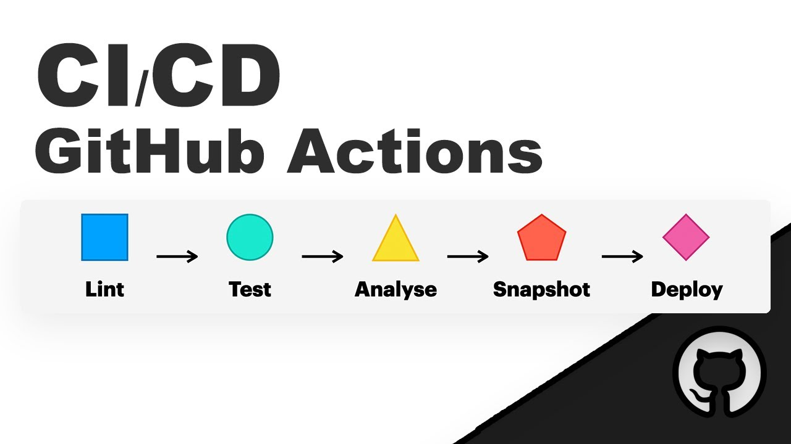

# INITIATION À GIT ET CI/CD




Ce guide a pour objectif de vous initier aux concepts de base de Git et de CI/CD (Intégration Continue et Livraison Continue/Déploiement Continu). Il est destiné aux développeurs débutants ou intermédiaires qui souhaitent apprendre à utiliser ces outils essentiels dans leur pratique quotidienne.

# Table des Matières

## Partie 1: Introduction à Git

### 1.1 Qu'est-ce que Git ?
- Définition et historique.
- Pourquoi Git est essentiel pour les développeurs.

### 1.2 Installation de Git
- Instructions d'installation pour différentes plateformes (Windows, macOS, Linux).

### 1.3 Configuration de base de Git
- Configurer l'utilisateur et l'email.
- Explication de la configuration globale vs locale.

### 1.4 Les bases de Git
- Création d'un dépôt local (git init).
- Clonage d'un dépôt distant (git clone).
- Les trois états de Git : modifié, indexé, et commité.

### 1.5 Travailler avec des branches
- Pourquoi utiliser des branches ?
- Création, changement, et fusion de branches (git branch, git checkout, git merge).

### 1.6 Collaboration avec Git
- Le modèle Fork & Pull.
- Gestion des conflits.

### 1.7 Les commandes de bases Git
- Commandes utiles pour gérer un dépôt Git.
- Pour une liste complète des commandes Git, consultez la documentation officielle.

## Partie 2: Introduction à CI/CD

### 2.1 Qu'est-ce que CI/CD ?
- Définition et composantes : Intégration Continue (CI), Livraison Continue (CD), Déploiement Continu (CD).
- Avantages de CI/CD.

### 2.2 Outils de CI/CD
- Présentation de quelques outils populaires (Jenkins, GitLab CI, GitHub Actions, CircleCI).

### 2.3 Intégration Continue (CI)
- Configuration d'un pipeline CI simple.
- Automatisation des tests.

### 2.4 Livraison Continue et Déploiement Continu (CD)
- Différences entre Livraison Continue et Déploiement Continu.
- Configuration d'un pipeline CD.
- Automatisation du déploiement.

## Partie 3: Projet Pratique

### 3.1 Création d'un projet exemple
- Configuration d'un dépôt Git pour le projet.
- Ajout d'un fichier README et d'un simple script.

### 3.2 Mise en place de CI/CD pour le projet
- Configuration d'un pipeline CI/CD avec un outil choisi.
- Écriture de tests simples.
- Automatisation des tests et du déploiement sur un serveur de test.

## Conclusion

- Récapitulatif des concepts appris.
- Meilleures pratiques pour Git et CI/CD.
- Ressources supplémentaires pour continuer à apprendre.

---

## Partie 1: Introduction à Git

### 1.1 Qu'est-ce que Git ?

#### Définition et historique

Git est un système de contrôle de version distribué, créé par Linus Torvalds en 2005. Il permet de suivre les modifications apportées à un ensemble de fichiers au fil du temps, et de coordonner le travail entre plusieurs personnes sur un même projet.

#### Pourquoi Git est essentiel pour les développeurs

Git est devenu un outil essentiel pour les développeurs car il offre de nombreux avantages :
- Historique complet des modifications.
- Gestion efficace des branches et des fusions.
- Collaboration facilitée entre les membres d'une équipe.
- Sauvegarde et partage du code en toute sécurité.
- Intégration avec des outils de CI/CD pour automatiser les processus de développement.
- Large adoption dans l'industrie du logiciel.

### 1.2 Installation de Git

#### Instructions d'installation pour différentes plateformes (Windows, macOS, Linux)

Pour installer Git sur votre machine, suivez les instructions spécifiques à votre plateforme :

- **Windows**: Téléchargez l'installeur depuis le site officiel de Git (https://git-scm.com/) et suivez les étapes d'installation.
- **macOS**: Utilisez Homebrew pour installer Git en tapant la commande `brew install git` dans votre terminal.
- **Créer un compte GitHub**: Pour pouvoir utiliser Git de manière optimale, créez un compte sur GitHub (https://github.com/signup?user_email=&source=form-home-signup) 
```bash
brew install git
```
- **Linux**: Utilisez le gestionnaire de paquets de votre distribution pour installer Git. Par exemple, sur Ubuntu, tapez `sudo apt install git`.
```bash
sudo apt install git
```
- Vérifiez que Git est correctement installé en tapant `git --version` dans votre terminal.
```bash
git --version
```

### 1.3 Configuration de base de Git

#### Configurer l'utilisateur et l'email

Avant d'utiliser Git, configurez votre nom d'utilisateur et votre adresse email en tapant les commandes suivantes dans votre terminal :
```bash
git config --global user.name "Votre Nom utilisateur GitHub"
git config --global user.email "Votre Adresse email GitHub"
```
#### Explication de la configuration globale vs locale

La configuration de Git peut être effectuée de deux manières :
- **Globale** : Les paramètres sont appliqués à tous les dépôts Git sur votre machine.
- **Locale** : Les paramètres sont spécifiques à un dépôt Git en particulier.
- Pour configurer un paramètre localement, remplacez `--global` par `--local` dans la commande.
- Pour voir la configuration actuelle, tapez `git config --list`.
```bash
git config --list
```
- Pour plus d'informations sur la configuration de Git, consultez la documentation officielle (https://git-scm.com/book/en/v2/Customizing-Git-Git-Configuration).

### 1.4 Les bases de Git

#### Création d'un dépôt local (git init)

Pour créer un nouveau dépôt Git local, placez-vous dans le répertoire du projet et tapez la commande suivante :
```bash
git init
```
#### Clonage d'un dépôt distant (git clone)

Pour cloner un dépôt Git distant sur votre machine, utilisez la commande `git clone` suivie de l'URL du dépôt :
```bash
git clone non du dépôt distant
```
#### Les trois états de Git : modifié, indexé, et commité

Git gère les fichiers en trois états principaux :
- **Modifié** : Les modifications apportées à un fichier mais non encore indexées.
- **Indexé** : Les modifications prêtes à être validées dans le prochain commit.
- **Commité** : Les modifications validées et enregistrées dans l'historique du dépôt.
- Pour voir l'état des fichiers dans votre dépôt, tapez `git status`.
```bash
git status
```

### 1.5 Travailler avec des branches

#### Pourquoi utiliser des branches ?

Les branches permettent de travailler sur des fonctionnalités ou des correctifs isolés du reste du code. Elles offrent de nombreux avantages :
- Isolation des modifications.
- Parallélisme dans le développement.
- Facilité de collaboration.
- Possibilité d'expérimenter sans affecter le code principal.
- Pour voir la liste des branches dans votre dépôt, tapez `git branch`.
```bash
git branch
```
#### Création, changement, et fusion de branches (git branch, git checkout, git merge)

Pour créer une nouvelle branche, utilisez la commande `git branch` suivie du nom de la branche :
```bash
git branch nom_de_la_branche
```
Pour changer de branche, utilisez la commande `git checkout` suivie du nom de la branche :
```bash
git checkout nom_de_la_branche
```
Pour fusionner une branche dans la branche actuelle, utilisez la commande `git merge` suivie du nom de la branche à fusionner :
```bash
git merge nom_de_la_branche
```

### 1.6 Collaboration avec Git

#### Le modèle Fork & Pull

Le modèle `Fork` & `Pull` est une méthode courante de collaboration sur des projets Git :
- **Fork** : Créez une copie du dépôt d'origine sur votre compte GitHub.
- **Clone** : Clonez votre fork sur votre machine locale.
- **Commit** : Effectuez des modifications et des commits sur votre fork.
- **Pull Request** : Proposez vos modifications pour être fusionnées dans le dépôt d'origine.
- **Merge** : Le propriétaire du dépôt d'origine peut fusionner vos modifications en acceptant le Pull Request.
- Pour plus d'informations sur le modèle Fork & Pull, consultez la documentation GitHub (https://docs.github.com/en/get-started/quickstart/github-flow).

### 1.7 Les commandes de bases Git

#### Commandes utiles pour gérer un dépôt Git

Voici quelques commandes de base pour gérer un dépôt Git :

- `git add` & `git add .`: Ajoute des fichiers modifiés à l'index.
```bash
git add nom_du_fichier # Ce fichier sera ajouté à l'index pour le prochain commit
git add . # Ajoute tous les fichiers modifiés à l'index
```
- `git commit`: Enregistre les modifications de l'index dans l'historique du dépôt.
```bash
git commit -m "Message de commit" # Enregistre les modifications avec un message. L'option -m est obligatoire et signifie "message".
```
- `git push`: Envoie les commits locaux vers un dépôt distant.
```bash
git push origin nom_de_la_branche # Envoie les commits de la branche locale vers la branche distante
```
- `git pull`: Récupère les commits d'un dépôt distant et les fusionne avec la branche locale.
```bash
git pull origin nom_de_la_branche # Récupère les commits de la branche distante et les fusionne avec la branche locale
```
- `git log`: Affiche l'historique des commits.
```bash
git log # Affiche l'historique des commits
```
- Pour une liste complète des commandes Git, consultez la documentation officielle (https://git-scm.com/doc).


## Partie 2: Introduction à CI/CD

### 2.1 Qu'est-ce que CI/CD ?

#### Définition et composantes : Intégration Continue (CI), Livraison Continue (CD), Déploiement Continu (CD)

CI/CD est une pratique de développement logiciel qui vise à automatiser les processus de développement, de test, et de déploiement :
- **Intégration Continue (CI)** : Automatisation des tests et de la construction du code à chaque modification.
- **Livraison Continue (CD)** : Automatisation du déploiement du code vers un environnement de test ou de production.
- **Déploiement Continu (CD)** : Automatisation du déploiement du code en production sans intervention humaine.
- Pourquoi CI/CD est essentiel pour les équipes de développement :
  - Réduction des erreurs.
  - Amélioration de la qualité du code.
  - Livraison plus rapide des fonctionnalités.
  - Meilleure collaboration entre les équipes.
  - Pour plus d'informations sur CI/CD, consultez la documentation de GitLab (https://docs.gitlab.com/ee/ci/).
  
### 2.2 Outils de CI/CD

#### Présentation de quelques outils populaires (Jenkins, GitLab CI, GitHub Actions, CircleCI)

Il existe de nombreux outils de CI/CD disponibles sur le marché, chacun avec ses propres fonctionnalités et avantages :
- **Jenkins** : Outil open-source de CI/CD très flexible et personnalisable.
- **GitLab CI** : Intégré à GitLab, offre une intégration étroite avec les dépôts Git.
- **GitHub Actions** : Intégré à GitHub, offre une automatisation puissante des workflows.
- **CircleCI** : Outil cloud de CI/CD avec une interface utilisateur intuitive.
- Pour choisir l'outil qui convient le mieux à votre équipe, évaluez les fonctionnalités, la facilité d'utilisation, et l'intégration avec vos outils existants.
  - Pour plus d'informations sur les outils de CI/CD, consultez les sites web officiels des outils mentionnés.

### 2.3 Intégration Continue (CI)

#### Configuration d'un pipeline CI simple

Un pipeline CI est une série d'étapes automatisées qui permettent de tester et de construire le code à chaque modification :
- **Étapes d'un pipeline CI** :
  - Récupération du code source.
  - Installation des dépendances.
  - Exécution des tests.
  - Génération des artefacts.
  - Pour configurer un pipeline CI, créez un fichier `.github-ci.yml` à la racine de votre dépôt GitHub avec les étapes nécessaires.
  - Pour plus d'informations sur la configuration d'un pipeline CI avec GitHub Actions, consultez la documentation GitHub (https://docs.github.com/en/actions).
- Exemple de fichier `.github-ci.yml` pour un pipeline CI simple :
```yaml
name: GitHub CI

on: [push]

jobs:
  build:
    runs-on: ubuntu-latest

    steps:
    - uses: actions/checkout@v2
    - name: Install dependencies
      run: npm install
    - name: Run tests
      run: npm test
```

### 2.4 Livraison Continue et Déploiement Continu (CD)

#### Différences entre Livraison Continue et Déploiement Continu

La Livraison Continue et le Déploiement Continu sont deux pratiques de CI/CD qui se distinguent par leur degré d'automatisation :
- **Livraison Continue** : Automatisation du déploiement du code vers un environnement de test ou de pré-production.
- **Déploiement Continu** : Automatisation du déploiement du code en production sans intervention humaine.
- Configuration d'un pipeline CD :
  - Ajoutez des étapes de déploiement à votre pipeline CI pour automatiser la livraison et le déploiement du code.
  - Utilisez des outils comme Ansible, Docker, ou Kubernetes pour automatiser le déploiement.
  - Pour plus d'informations sur la configuration d'un pipeline CD, consultez la documentation de l'outil de CI/CD que vous utilisez.
- Exemple d'étapes de déploiement dans un pipeline CD :

```yaml
name: GitHub CD

on:
  push:
    branches:
      - main

jobs:
  deploy:
    runs-on: ubuntu-latest

    steps:
      - uses: actions/checkout@v2

      - name: Install dependencies
        run: npm install

      - name: Run tests
        run: npm test

      - name: Deploy to production
        run: |
          ssh user@server "cd /path/to/app && git pull && npm install && pm2 restart app"
```

## Partie 3: Projet Pratique

### 3.1 Création d'un projet exemple

#### Configuration d'un dépôt Git pour le projet

Pour créer un nouveau dépôt Git pour votre projet, suivez ces étapes :
- Créez un nouveau dépôt sur GitHub.
- Clonez le dépôt sur votre machine locale.
- Initialisez un projet HTML/CSS/ 
- Ajoutez un fichier README.md et un simple fichier index.html.
```bash
git clone url_du_dépôt
```
#### Ajout d'un fichier README et d'un simple  index.html

Créez un fichier README.md à la racine de votre projet avec une description du projet :
```markdown
# Mon Projet Exemple

Ce projet est un exemple de projet utilisant Git et CI/CD.
```

Créez un fichier index.html à la racine de votre projet avec un contenu HTML simple :
```html
<!DOCTYPE html>
<html lang="en">
<head>
    <title>Mon Projet Exemple</title>
</head>
<body>
    <h1>Bienvenue sur Mon Projet Exemple</h1>
    
    <p>Ceci est un exemple de projet utilisant Git et CI/CD.</p>
</body>
</html>
```

### 3.2 Mise en place de CI/CD pour le projet

#### Configuration d'un pipeline CI/CD avec un outil choisi

Pour configurer un pipeline CI/CD pour votre projet, suivez ces étapes :
- Utilisez un outil de CI/CD (GitHub Actions).
- créez un dossier `.github` à la racine de votre projet. 
- Créer un autre dossier `workflows` dans le dossier `.github`.
- Créez un fichier `ci-cd.yml` dans le dossier `workflows` avec les étapes nécessaires pour le pipeline CI/CD.
```bash
mkdir .github
cd .github
mkdir workflows
cd workflows
touch ci-cd.yml
```
- Exemple de fichier `ci-cd.yml` pour un pipeline CI/CD simple avec GitHub Actions :
```yaml
# Simple workflow for deploying static content to GitHub Pages
name: Deploy static content to Pages

on:
  # Runs on pushes targeting the default branch
  push:
    branches: ["development"]

  # Allows you to run this workflow manually from the Actions tab
  workflow_dispatch:

# Sets permissions of the GITHUB_TOKEN to allow deployment to GitHub Pages
permissions:
  contents: read
  pages: write
  id-token: write

# Allow only one concurrent deployment, skipping runs queued between the run in-progress and latest queued.
# However, do NOT cancel in-progress runs as we want to allow these production deployments to complete.
concurrency:
  group: "pages"
  cancel-in-progress: false

jobs:
  # Single deploy job since we're just deploying
  deploy:
    environment:
      name: github-pages
      url: ${{ steps.deployment.outputs.page_url }}
    runs-on: ubuntu-latest
    steps:
      - name: Checkout
        uses: actions/checkout@v4
      - name: Setup Pages
        uses: actions/configure-pages@v5
      - name: Upload artifact
        uses: actions/upload-pages-artifact@v3
        with:
          # Upload entire repository
          path: '.'
      - name: Deploy to GitHub Pages
        id: deployment
        uses: actions/deploy-pages@v4
```

#### Écriture de tests simples

Pour écrire des tests pour votre projet, créez un fichier `tests.js` à la racine de votre projet avec des tests unitaires simples :
```javascript
const sum = (a, b) => a + b;

test('adds 1 + 2 to equal 3', () => {
  expect(sum(1, 2)).toBe(3);
});
```

#### Automatisation des tests et du déploiement sur un serveur de test

Pour automatiser les tests et le déploiement sur un serveur de test, ajoutez des étapes supplémentaires à votre pipeline CI/CD :

- Exemple d'étapes de tests et de déploiement dans un pipeline CI/CD :
```yaml
name: GitHub CI/CD

on: [push]

jobs:
  build:
    runs-on: ubuntu-latest

    steps:
    - uses: actions/checkout@v2
    - name: Install dependencies
      run: npm install
    - name: Run tests
      run: npm test
    - name: Deploy to test server
      run: |
        ssh user@server "cd /path/to/app && git pull && npm install && pm2 restart app"
```

## Conclusion

Ce guide a couvert les concepts de base de Git et de CI/CD, ainsi que leur mise en pratique dans un projet simple. En suivant ces instructions, vous avez appris à utiliser Git pour gérer votre code et à automatiser les processus de développement avec CI/CD. Pour continuer à apprendre et à vous perfectionner, consultez les ressources supplémentaires suivantes :

- Documentation officielle de Git : https://git-scm.com/doc